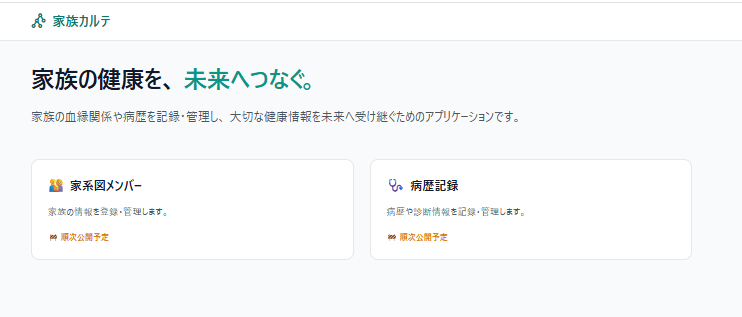

# 家族カルテ（pedigree-app）



> 家族の病歴を、次の世代へ。

家族・祖先の血縁関係と病歴を記録し、将来的には遺伝子情報も含めて一元管理することを目指したWebアプリケーションです。

Laravelを用いたポートフォリオとして開発していますが、単なる学習用CRUDではなく、実際に利用できるサービスを目標に設計・実装を進めています。

---

# 📖 プロジェクト紹介

## 背景

病院で

「ご家族に○○の病気の方はいらっしゃいますか？」

と聞かれた際、祖父母や親族の病歴を正確に答えられないことがあります。

家族の病歴は、自分だけでなく子どもや孫の健康にも関わる重要な情報ですが、

- 家族の記憶
- 紙のメモ
- 口頭での引き継ぎ

に頼ることが多く、世代を超えて管理する仕組みはあまり整っていません。

この課題を解決するため、

**血縁関係・病歴・将来的には遺伝子情報まで一元管理できるサービス**

として本プロジェクトを企画しました。

---

## 開発目的

このプロジェクトでは

- LaravelによるWebアプリケーション開発
- データベース設計
- Git / GitHubを用いた開発フロー
- ドキュメント作成
- 保守性を考慮した設計

まで、一連の開発プロセスを経験することを目的としています。

---

# ✨ 現在の実装範囲（v1）

- Laravel Fortifyによる認証
- 人物管理（Person CRUD）
- 病名マスタ管理
- 病歴管理
- 血縁情報（自己参照リレーション）

---

# 🚀 今後追加予定

- 家系図表示
- パートナー・再婚管理
- 養子情報管理
- 遺伝子検査情報
- 家族共有
- 権限管理
- AIを活用した健康リスク表示

---

# 🛠 使用技術

| 分類            | 技術                         |
| --------------- | ---------------------------- |
| Backend         | Laravel 10                   |
| Authentication  | Laravel Fortify              |
| Frontend        | Blade / Tailwind CSS         |
| Database        | MySQL                        |
| Development     | Laravel Sail / Docker / WSL2 |
| Version Control | Git / GitHub                 |

---

# 🏗 システム構成

```
Browser
      │
      ▼
Laravel (Blade)
      │
Laravel Fortify
      │
Eloquent ORM
      │
MySQL
```

---

# 🚀 セットアップ

## 必要環境

- Docker Desktop
- WSL2
- Git

## インストール

```bash
git clone https://github.com/shiho5shiho/pedigree-app.git

cd pedigree-app

cp .env.example .env

./vendor/bin/sail up -d

./vendor/bin/sail artisan migrate

./vendor/bin/sail artisan key:generate
```

ブラウザで

```
http://localhost
```

へアクセスしてください。

---

# 📂 ドキュメント

このリポジトリでは、アプリケーションのソースコードだけでなく、要件・設計・実装・改善までの開発プロセスも記録しています。<br>
実装だけでは伝わらない設計意図や判断理由については、`docs/` 配下のドキュメントをご覧ください。

| Document            | 内容                     |
| ------------------- | ------------------------ |
| 00_ProjectVision.md | プロジェクトの背景・目的 |
| 01_Requirements.md  | 要件定義                 |
| 02_DomainModel.md   | ドメイン設計             |
| 03_DecisionLog.md   | 設計判断の記録           |
| 04_Roadmap.md       | 今後の開発計画           |
| 05_LearningLog.md   | 開発を通じて学んだこと   |

---

# 📋 開発ポリシー

このプロジェクトでは、「動くものを作る」だけでなく、
保守性・拡張性を考慮した開発を意識しています。

- 実装前に要件・設計を整理する
- 設計変更時はドキュメントも更新する
- 1 Issue = 1 Pull Request を基本とする
- 将来の機能追加を考慮した設計を心掛ける

---

# 📈 開発状況

現在は **v1（血縁関係・病歴管理）** を開発中です。

GitHub Projectsを利用しながら継続的に改善しています。

---

# 📄 License

将来的に検討